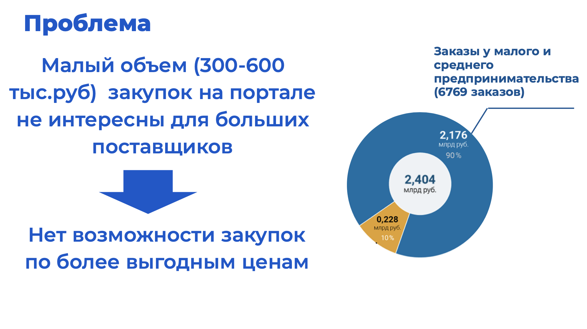
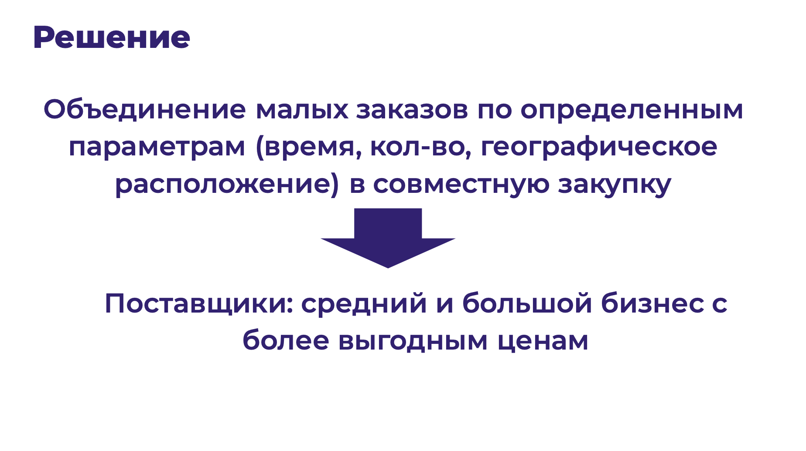
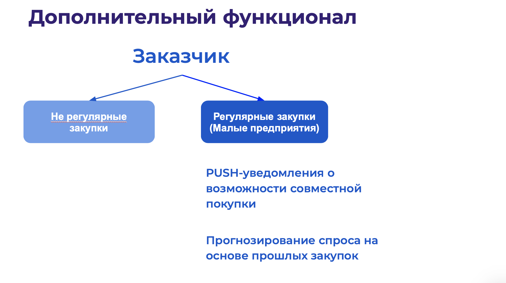
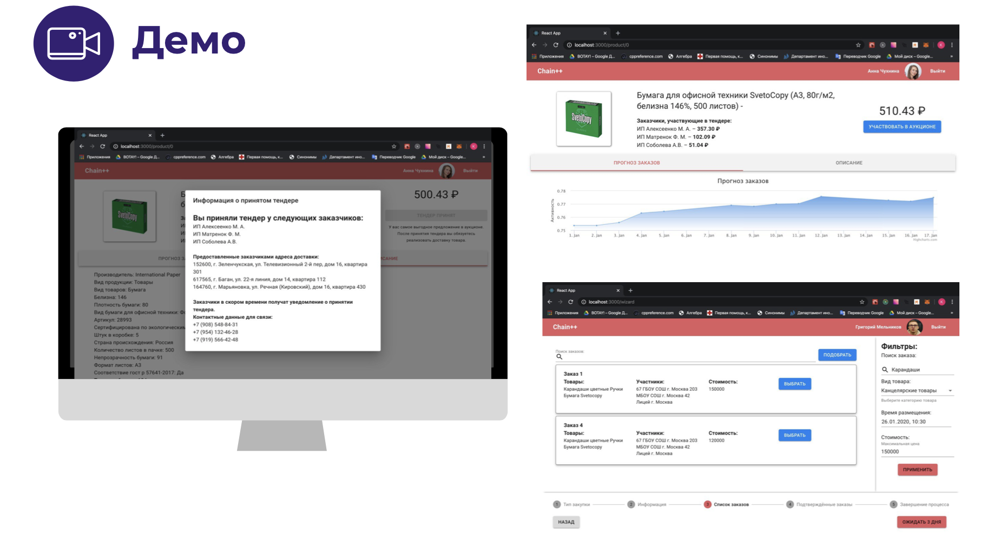
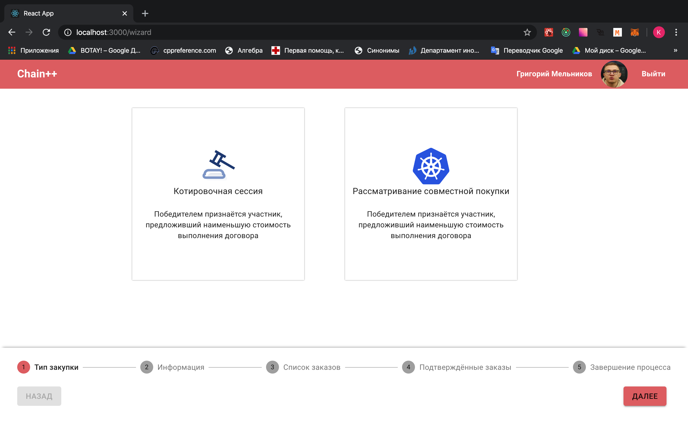
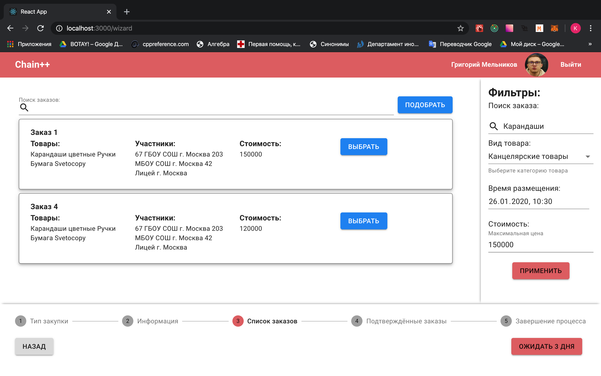
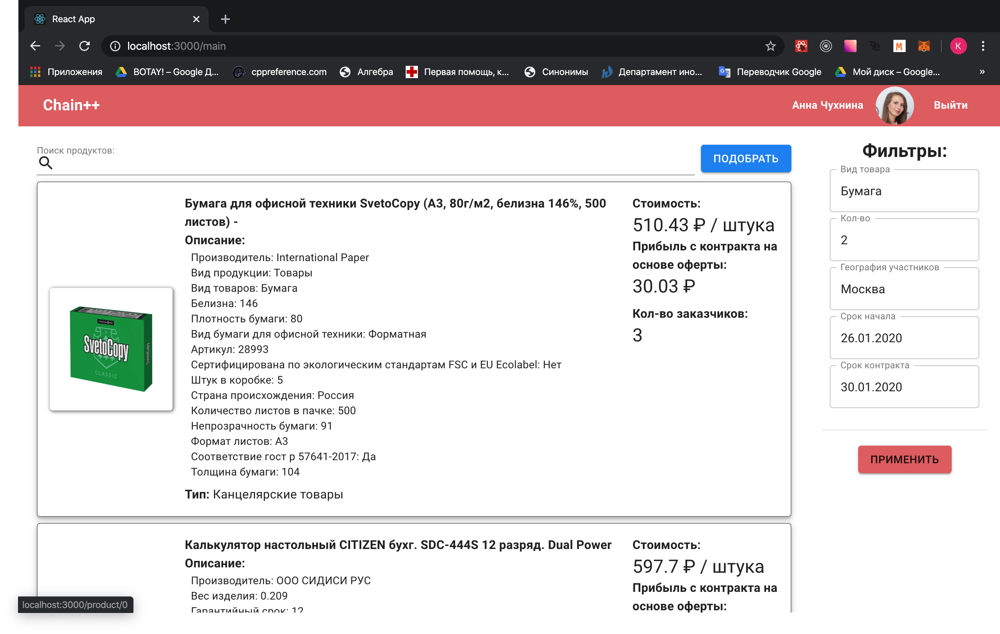
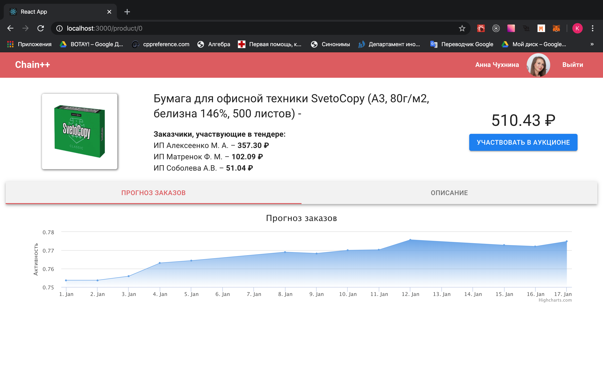
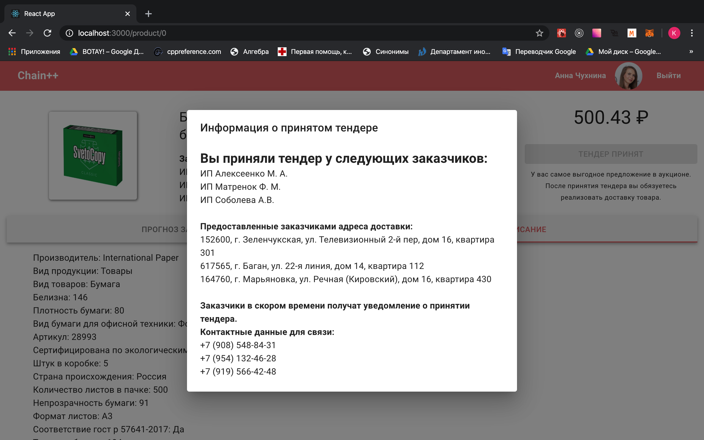

# Chain Metric

# Structure

<ol type="1" style="font-size: x-large;">
  <li> <a href="https://github.com/Kyzyl-ool/startblock-tenderhack#проблема">Проблема</a>
  <li> <a href="https://github.com/Kyzyl-ool/startblock-tenderhack#решение">Решение</a>
  <li> <a href="https://github.com/Kyzyl-ool/startblock-tenderhack#алгоритм-совместных-покупок">Алгоритм совместных покупок</a>
  <li> <a href="https://github.com/Kyzyl-ool/startblock-tenderhack#дополнительный-функционал">Дополнительный функционал</a>
  <li> <a href="https://github.com/Kyzyl-ool/startblock-tenderhack#демо">Демо</a>
  <li> <a href="https://github.com/Kyzyl-ool/startblock-tenderhack#техническое-описание">Техническое описание</a>
  <li> <a href="https://github.com/Kyzyl-ool/startblock-tenderhack#инструкция-по-установке">Инструкция по установке</a>
  <li> <a href="https://github.com/Kyzyl-ool/startblock-tenderhack#команда">Команда</a>

# Проблема

# Решение

<a href="https://www.youtube.com/watch?v=-3xvlPHu1Rg&feature=youtu.be">Video-presentation of the TrustMe</a>

# Алгоритм совместных покупок

# Дополнительный функционал

# Демо

# Техническое описание

# Инструкция по установке
Requirements:
1. rustc 1.39.0-nightly (97e58c0d3 2019-09-20)
2. exonum
3. fantom

For running nodes on your local machine
1. cd backend
2. cargo insstall --path .
3. ./launch.sh %number of nodes%
4. Open a browser at address stated in terminal

# Команда

